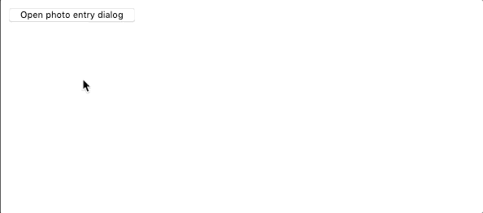

# Assignment 1

The goal of this assignment is to have you begin to write React components and compose them together into a simple application.  At the end, you will have written an application in which the user can click a button to open a dialog, enter information about photos into that dialog, and see those photos appear in the application when they click the dialog’s “accept” button.  Additionally, users will be able to remove each photo from the application with the click of a button.  More details about the application you’ll write are below.  First, here’s a short screen capture demonstrating how the application should roughly work:


## Application layout

Your application should be laid out in two columns.  The contents of each column should be as follows:
  * **Left column** – The left column should start out containing only a button.  When the user clicks this button, a “dialog” should also appear in the left column.  More details about the dialog will be described below.
  * **Right column** – The right column will contain a list of all the photos submitted by the user.  More details about the photos will be described below.

## Photo submission dialog

When the user clicks the “open dialog” button in the left column, a dialog should appear in the left column, below the button.  This dialog will contain fields and controls that allow the user to submit information about a photo to be displayed in the application’s right column.  In particular, the dialog should contain the following elements:
  * A text field in which the user can enter the URL of a photo.
  * A text field in which the user can enter the caption of a photo.
  * An “accept” button.
  * A “cancel” button.

The dialog should have the following behaviors:
  * If the user enters values in both fields (photo URL and caption) and clicks the accept button, then a corresponding photo should be added to the right column, and the dialog should close.
  * If the user clicks the accept button while either text field is empty, then a small warning should appear to let the user know they need to enter both a URL and a caption.  The dialog should remain open in this case.
  * If the user hits the cancel button, then the dialog should close without further action.
  * Any time the dialog is closed (whether via the accept button or the cancel button), any values entered by the user in the text fields should be cleared.

Here is a screen capture demonstrating some of these behaviors:



## Photo list

The application’s right column should contain a list of all the photos submitted by the user via the dialog described above.  Each photo should be displayed in a simple card component that contains both the image and its corresponding caption.  The photo cards may be laid out in any sensible way (the layout doesn’t have to match the screen captures here) with the following constraints:
  * The most recently submitted photo should appear first in the list.
  * The photos may not overflow the viewport in the horizontal direction.  In other words, the user should not have to scroll horizontally to see more photos.  Scrolling vertically is fine.

## Photo removal

Finally, you should add a button to each photo component that the user can click to remove the corresponding photo.  Only the photo corresponding to the clicked button should be removed, and all other photos should remain, displayed in the same order.

Here is a screen capture demonstrating how the photo removal functionality might work:


## Running the Application

Before running this app for the first time, make sure to run `npm install` to install needed dependencies.  Then, to run the app and see it in your browser, you can run
```
npm start
```
This will run the app in the development mode, and it should automatically open [http://localhost:3000](http://localhost:3000) to view the app in your browser (though you can manually open that URL in your browser, too).  The app is set up so that the page will reload if you make edits to the code.  You will also see any lint errors in the console.
